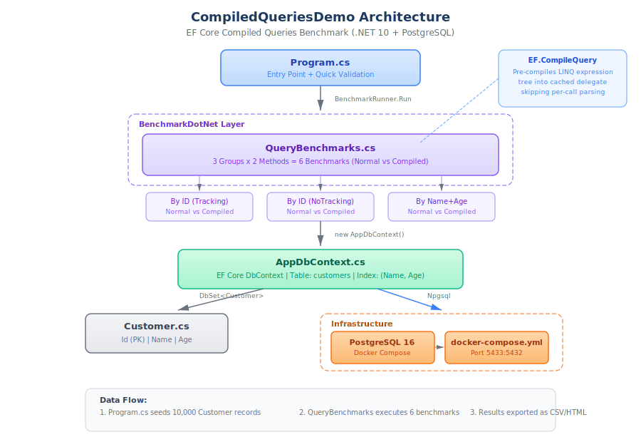

# CompiledQueriesDemo

EF Core 编译查询性能基准测试 | EF Core Compiled Queries Performance Benchmark



## Tech Stack / 技术栈

| Component | Version |
|-----------|---------|
| .NET | 10.0 |
| EF Core | 10.0.9 |
| Npgsql.EntityFrameworkCore.PostgreSQL | 10.0.2 |
| BenchmarkDotNet | 0.15.8 |
| PostgreSQL | 16 (Docker) |

## Project Structure / 项目结构

| Module | File | Responsibility |
|--------|------|---------------|
| Entry Point | `Program.cs` | 数据库初始化、种子数据、启动 BenchmarkDotNet |
| Benchmarks | `Benchmarks/QueryBenchmarks.cs` | 6 个基准测试（3 组 Normal vs Compiled） |
| Data Access | `Data/AppDbContext.cs` | EF Core DbContext，配置 `customers` 表映射 |
| Model | `Models/Customer.cs` | Customer 实体（Id, Name, Age） |
| Infrastructure | `docker-compose.yml` | PostgreSQL 16 容器（端口 5433:5432） |

## Data Flow / 数据流

1. `Program.cs` 启动时创建数据库，插入 10,000 条种子数据
2. 先运行快速验证，确认编译查询与普通查询结果一致
3. `BenchmarkRunner` 执行 6 个基准测试，每组对比 Normal vs `EF.CompileQuery`
4. 结果导出为 CSV / Markdown / HTML

## Quick Start / 快速开始

```bash
# 1. 启动 PostgreSQL
docker compose up -d

# 2. 运行基准测试（Release 模式，结果更准确）
dotnet run -c Release --project CompiledQueriesDemo

# 3. 或仅构建验证
dotnet build
```

## Benchmark Results / 基准测试结果

> BenchmarkDotNet v0.15.8, AMD Ryzen 7 6800H, .NET 10, PostgreSQL 16 (Docker)

| Method | Mean | Median | vs Baseline |
|--------|------|--------|------------|
| Normal Query (ID, Tracking) | 713.2 us | 682.0 us | **1.00 (baseline)** |
| Compiled Query (ID, Tracking) | 660.2 us | 650.3 us | 0.95x |
| Normal Query (ID, NoTracking) | 654.4 us | 624.6 us | 0.94x |
| Compiled Query (ID, NoTracking) | 640.7 us | 631.5 us | 0.92x |
| Normal Query (Name + Age) | 745.4 us | 742.8 us | 1.07x |
| **Compiled Query (Name + Age)** | **620.2 us** | **616.7 us** | **0.89x** |

### Key Findings / 关键发现

- **Compiled Query 在复合条件查询上效果最显著**，比普通查询快约 11%
- **NoTracking 的提升比 Compiled Query 更大**（~8%），省去 Change Tracker 开销
- **两者组合效果最佳**：Compiled + NoTracking 比基线快约 10%

## How EF.CompileQuery Works

`EF.CompileQuery` 将 LINQ 表达式树预编译为缓存的委托，跳过每次调用时的表达式解析开销：

```csharp
// 定义编译查询
private static readonly Func<AppDbContext, int, Customer?> GetById =
    EF.CompileQuery((AppDbContext ctx, int id) =>
        ctx.Customers.FirstOrDefault(c => c.Id == id));

// 使用 - 无需每次编译表达式
var customer = GetById(context, 42);
```

## License

MIT
